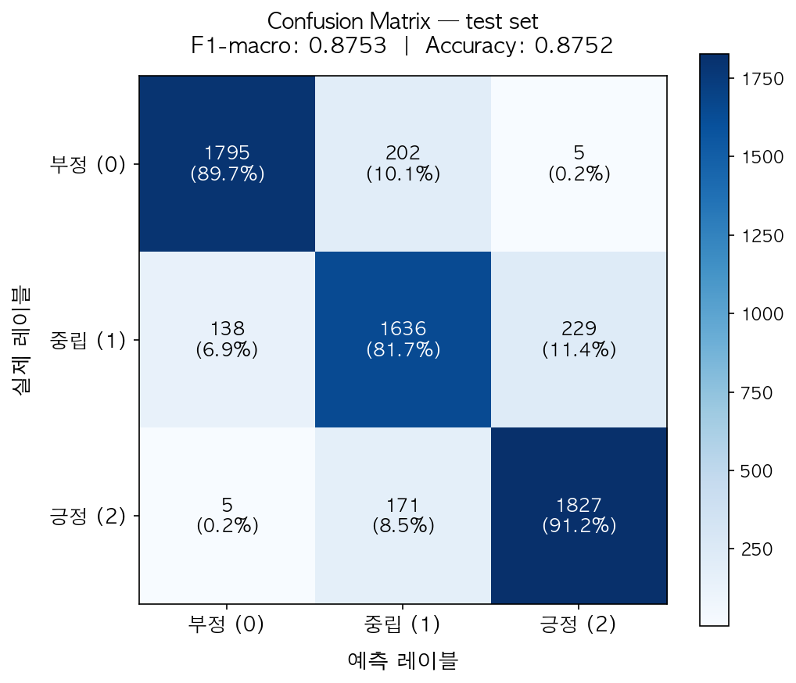
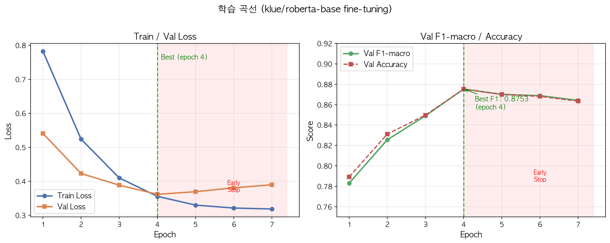

# SentiChat — 감정 분석 기반 고객 서비스 AI 챗봇

고객이 화가 난 상태로 문의를 보냈을 때, 챗봇이 그걸 눈치채고 다르게 반응하면 어떨까?  
이 프로젝트는 그 아이디어에서 시작했습니다.

한국어 감정 분류 모델(`klue/roberta-base` fine-tuning)과 RAG 파이프라인을 결합해,  
고객의 감정 상태를 실시간으로 파악하고 그에 맞는 응답을 자동으로 생성합니다.  
부정 감정이 심한 경우엔 자동으로 상담원 연결 진행

> 개인 프로젝트로 약 3주간 진행했습니다.  
> AI Hub 실데이터 183K를 직접 정제·학습시켜 **F1-macro 0.8753** 달성.

---

## 어떤 문제를 해결하려 했나

기존 룰 기반 챗봇은 감정을 인식하지 못합니다.  


SentiChat은 두 문장을 다르게 처리합니다:
- 중립적인 문의 또는 문장일 경우 → 중립 감정 → FAQ 안내
- 부정적인 문의 또는 문장일 경우 → 부정 감정(확률 87%) → 공감 먼저, 해결책 후, 상담원 연결 안내

---

## 주요 기능

| 기능 | 설명 |
|------|------|
| **3-class 감정 분류** | 부정 / 중립 / 긍정, klue/roberta-base fine-tuning |
| **RAG 응답** | FAISS 벡터스토어에서 관련 FAQ를 검색해 LLM 컨텍스트로 주입 |
| **자동 에스컬레이션** | 부정 확률 ≥ 70% 시 상담원 연결 권고 (`escalate: true`) |
| **세션 관리** | session_id 기반 멀티 세션, 최근 10턴 히스토리 유지, 최대 5,000 세션 상한 (OOM 방지) |
| **REST API** | `/api/v1/analysis/`, `/api/v1/analysis/batch`, `/api/v1/chat/` |
| **Gradio 데모** | 감정 확률 바 시각화 + 에스컬레이션 알림 내장 |
| **응대 범위 제한** | 쇼핑 관련 문의만 응답, 무관한 질문은 정중히 거절 (토큰 낭비 방지) |
| **프롬프트 보안** | 기술 스택 노출 차단 · 프롬프트 인젝션 방지 · 개인정보 입력 차단 · 욕설 대응 |

---

## 기술 스택

```
ML/DL         klue/roberta-base (110M) · PyTorch 2.x · Transformers · scikit-learn
LLM Pipeline  LangChain 0.3 LCEL · ChatOpenAI (GPT-4o-mini) · FAISS · jhgan/ko-sbert-nli
Backend       FastAPI 0.115 · Pydantic v2 · pydantic-settings · uvicorn
UI            Gradio 4.x
Logging       loguru (파일 rotation 30일)
Packaging     Poetry · Python 3.11
```
---

## 이 프로젝트에서 모델은 2개로 진행했습니다!

헷갈릴 수 있어서 아키텍처 보기 전에 먼저 짚고 가보겠습니다.

```
[ 모델 1 ]  klue/roberta-base (프로젝트에서 직접 fine-tuning한 모델)
┌──────────────────────────────────────────────────────────────┐
│  역할      텍스트 입력 → 부정 / 중립 / 긍정 확률 출력                 │
│  실행 위치 우리 서버 로컬 (PyTorch, GPU / MPS / CPU)              │
│  속도      ~20ms                                              │
│  비용      학습 후 .pt 파일로 저장 → 추론 비용 0원                   │
│  파일      saved_models/sentiment_best.pt                     │
└──────────────────────────────────────────────────────────────┘

[ 모델 2 ]  GPT-4o-mini (OpenAI API 호출)
┌──────────────────────────────────────────────────────────────┐
│  역할      감정 결과 + FAQ 컨텍스트 + 히스토리 → 응답 생성             │
│  실행 위치 OpenAI 서버 (네트워크 API 호출)                          │
│  속도      ~300ms                                             │
│  비용      토큰당 과금                                           │
└──────────────────────────────────────────────────────────────┘
```

klue/roberta-base를 fine-tuning 했다는 의미는

```
[STEP 1]  HuggingFace에서 klue/roberta-base 내려받기
                ↓
          이미 한국어 60GB로 사전학습이 끝난 110M 파라미터 모델
          이 시점엔 감정 분류를 모름. 언어만 이해함.

[STEP 2]  모델 위에 분류 헤드(head) 얹기
                ↓
          klue/roberta-base
          └── [CLS] 토큰 벡터 (768차원)
               └── Dropout(0.3)
                    └── Linear(768 → 3)   ← 부정 / 중립 / 긍정

[STEP 3]  AI Hub 60K 데이터로 추가 학습 (fine-tuning, ~45분)
                ↓
          saved_models/sentiment_best.pt  ← 우리가 만든 감정 분류 모델
```

"모델을 만들었다"는 신경망을 처음부터 설계한건 아니고
한국어를 이미 이해하는 대형 모델에 **3-class 분류 레이어만 추가해서**  
우리 데이터(감정 레이블)로 조정해보았습니다.

## 아키텍처

```
클라이언트 요청 (POST /api/v1/chat/)
          │
          ▼
    FastAPI (main.py)
          │
    ┌─────┴──────┐
    │            │                (스레드풀에서 병렬 실행)
    ▼            ▼                (이벤트 루프 블로킹 방지)
SentimentService  RAGService
klue/roberta      FAISS 벡터 검색
   fine-tune      유사 FAQ k개
    │            │
    └─────┬──────┘
          │
          ▼
   SentimentChatChain  (LangChain LCEL)
   ┌─────────────────────────────────┐
   │  SystemPrompt (감정별 응대방침)     │
   │  + 감정 결과 + FAQ 컨텍스트          │
   │  + 대화 히스토리                    │
   └────────────────────┬────────────┘
                        │
                        ▼
               ChatOpenAI (GPT-4o-mini)
                        │
                        ▼
              ChatResponse (escalate 포함)
```

---

## 모델 성능

AI Hub 한국어 감정 데이터셋 기반, 최종 test set(6,008건) 결과입니다.

| 지표 | 값 |
|------|----|
| **F1-macro** | **0.8753** |
| **Accuracy** | **87.52%** |
| 부정 F1 | 0.9112 |
| 중립 F1 | 0.8156 |
| 긍정 F1 | 0.8991 |
| 학습 데이터 | 48,060 (train) / 6,007 (val) / 6,008 (test) |
| 학습 시간 | ~45분 (Apple Silicon MPS) |

실전 채팅 예문 10개 중 9개 정확 분류.  
오분류 1건: "환불 방법 알려주세요" → 부정으로 예측 (환불 요청이 부정 감정 문장과 함께 학습된 데이터 특성 때문)

---

### Confusion Matrix



각 셀의 숫자는 **실제 레이블 → 예측 레이블**로 분류된 샘플의 수입니다.
괄호 안에 퍼센트는 해당 실제 클래스 내 비율입니다.

**그래프 해석 방법:**
- 대각선(좌상→우하)이 **정답**입니다. 숫자가 클수록 잘 맞춘 것입니다.
- 대각선 바깥이 **오분류**입니다.

**눈에 띄는 패턴:**
- **부정 → 중립 오분류**가 비교적 적습니다 (91.1% 정확).  
  ex) "진짜 짜증나" 같은 명확한 부정 표현은 잘 잡힙니다.
- **중립의 오분류율이 가장 높습니다** (F1 0.8156).  
  ex) "환불 방법 알려주세요"처럼 요청 문장이 부정/긍정 경계에 걸리기 때문입니다.  
  중립은 정의하는 것 자체가 애매모호해서 헷갈리는 케이스가 많았던 것 같습니다!
- **긍정 → 중립 오분류**가 일부 발생합니다.  
  ex) "빠른 배송 감사합니다" 같은 차분한 긍정 표현이 중립으로 분류되는 케이스입니다.

---

### 학습 곡선



**Loss 그래프 (왼쪽):**
- Train Loss는 에폭마다 꾸준히 감소하는걸 볼 수 있었습니다..
- Val Loss는 epoch 4 이후 반등한 것으로 보이는데 반등한 곳부터는 **과적합 시작 지점**이라고 보면 될듯!
- epoch 4에서 Val F1이 최고치(0.8753)를 찍고 이후 하락 → epoch 7에서 Early Stopping 처리
- `saved_models/sentiment_best.pt`는 epoch 4 시점의 가중치 모델 best.pt로 저장

**F1 / Accuracy 그래프 (오른쪽):**
- Val F1과 Val Accuracy가 거의 동일한 것으로 보이기 때문에 클래스 균형이 잘 맞춰졌다는 의미로 해석해도 될 것 같습니다.
- epoch 4 이후 성능이 조금씩 떨어지지만 급격히 떨어지는 추세는 아니였습니다.
  Early Stopping을 사용해서 F1스코어 점수가 제일 높은 에폭 지점에서 중단 및 저장 처리.

---

## 학습 파이프라인에서 힘들었던 점..

처음엔 120개짜리 합성 데이터로 학습했는데 결과가 좋지 않았습니다.
"답변을 왜이렇게 늦게해요? 짜증나네요"를 긍정으로 분류할 정도..?

문제를 해결하기 위해 세 가지를 바꿨습니다.

**1. 데이터 교체 — AI Hub 실데이터 183K 활용**  
AI hub사이트를 활용하여 감정데이터셋을 가져와서 `build_dataset.py` 스크립트로 자동화 시켰습니다.
현재 로컬에서 25개의 데이터셋 ZIP 파일에서 `RawText`와 `GeneralPolarity`를 추출하고,  
부정, 중립, 긍정 3개 클래스를 언더샘플링으로 1:1:1로 맞췄습니다.

**2. 클래스 가중치 적용**  
데이터를 균형잡아도 모델이 긍정으로 쏠리는 경향이 있어,  
`compute_class_weight`로 자동 가중치를 계산해 CrossEntropyLoss에 주입했습니다.

**3. Early Stopping + MPS 지원**  
patience=3으로 조기 종료를 걸고, Apple Silicon GPU(MPS)를 활용해  
학습 시간을 단축시키려고 했습니다. (하지만 시간 단축된 것은 확연하게 보이진 않았고 다음부터는 구글코랩으로 gpu를 사용할 것 같습니다..)

---

## 빠른 시작

```bash
# 1. 의존성 설치
poetry install
poetry run pip install torch torchvision torchaudio   # macOS

# 2. 환경 변수
cp .env.example .env
# .env에서 OPENAI_API_KEY 입력

# 3. 데이터셋 구축 (data/aihub_dataset/ 에 AI Hub ZIP 배치 후)
poetry run python scripts/build_dataset.py

# 4. 모델 학습
poetry run python scripts/train.py --epochs 10 --early_stop 3

# 5. 학습 성능 확인
poetry run python scripts/evaluate.py

# 6. RAG 벡터스토어 구축
poetry run python scripts/build_vectorstore.py

# 7. 서버 실행
poetry run uvicorn main:app --reload

# 8. (선택) Gradio 데모
poetry run python app.py
```

---

## API 사용 예시

```bash
# 단일 감정 분석
curl -X POST http://localhost:8000/api/v1/analysis/ \
     -H "Content-Type: application/json" \
     -d '{"text": "배송이 너무 늦어요. 정말 실망입니다."}'

# 응답 예시
# {
#   "label": 0,
#   "label_str": "부정",
#   "negative": 0.91,
#   "neutral": 0.06,
#   "positive": 0.03,
#   "escalate": true
# }

# 챗봇 대화
curl -X POST http://localhost:8000/api/v1/chat/ \
     -H "Content-Type: application/json" \
     -d '{"session_id": "user-001", "message": "환불은 어떻게 하나요?"}'

# Swagger UI
open http://localhost:8000/docs
```

---

## 프로젝트 구조

```
sentiment_chatbot/
├── api/
│   ├── deps.py              # FastAPI 의존성 주입
│   └── routes/
│       ├── analysis.py      # POST /api/v1/analysis/
│       └── chat.py          # POST /api/v1/chat/
├── chains/
│   └── qa_chain.py          # LangChain LCEL 체인 (감정별 프롬프트)
├── core/
│   ├── config.py            # pydantic-settings 전역 설정
│   └── logging.py           # loguru 중앙 로거
├── knowledge_base/
│   └── faq.txt              # RAG 참조 문서 (배송/교환/환불 FAQ)
├── models/
│   └── sentiment.py         # SentimentClassifier + SentimentInference
├── schema/
│   ├── chat.py              # ChatRequest / ChatResponse
│   └── sentiment.py         # SentimentLabel / SentimentResult
├── scripts/
│   ├── build_dataset.py     # AI Hub ZIP → 균형 train/val/test.csv
│   ├── train.py             # fine-tuning (클래스 가중치, Early Stopping, MPS)
│   ├── evaluate.py          # test F1 + 실전 예문 검증
│   └── build_vectorstore.py # knowledge_base → FAISS 인덱스
├── services/
│   ├── chat_service.py      # 감정분석 → RAG → LLM 오케스트레이션
│   ├── rag_service.py       # FAISS 싱글턴 래퍼
│   └── sentiment_service.py # SentimentInference 싱글턴 래퍼
├── tests/
│   ├── test_api.py          # FastAPI TestClient 통합 테스트
│   └── test_sentiment.py    # 모델 단위 테스트
├── app.py                   # Gradio 데모 UI
├── main.py                  # FastAPI 진입점 (lifespan, CORS)
└── pyproject.toml
```

---

## 설계에서 고민했던 것들

**왜 run_in_threadpool을 썼나**  
`async def chat()`에서 PyTorch 추론과 FAISS 검색을 그냥 호출하면  
FastAPI 이벤트 루프가 통째로 멈춥니다. `run_in_threadpool`로 별도 스레드에서  
실행해 동시 요청 처리를 유지했습니다.

**왜 서버 시작 시 모델을 미리 로드하나**  
첫 요청에 모델을 로드하면 응답이 수십 초 걸립니다.  
`lifespan` 이벤트에서 워밍업해두면 실제 요청은 빠르게 처리됩니다.  
모델 파일이 없으면 서버가 시작조차 안 되도록 `raise`로 막아뒀습니다.

**세션 히스토리를 인메모리로 한 이유**  
Redis 연동은 인프라 의존성이 생기고 데모 프로젝트 범위를 벗어납니다.  
`defaultdict`로 간단하게 구현하되, 주석에 Redis 교체 지점을 명시했습니다.

---

## 개발 중 마주쳤던 이슈

---

**이슈 1 — RAG 응답이 매 요청마다 5초 이상 걸리는 문제**
- **원인** : 쿼리를 벡터로 변환할 때마다 OpenAI `text-embedding-3-small` API를 호출 → 네트워크 왕복 ~5.2s
- **해결** : `jhgan/ko-sbert-nli` 로컬 임베딩 모델로 교체 → RAG **~5.2s → ~0.2s**, 임베딩 비용 **$0**
- **추가** : 감정 분석 + RAG를 `asyncio.gather`로 병렬 실행 → 총 응답 **~8s → ~3s**

| 구간 | 개선 전 | 개선 후 |
|---|---|---|
| RAG 검색 (요청당) | ~5.22s | ~0.21s |
| 임베딩 API 비용 | 요청마다 과금 | **$0** |
| 총 응답 시간 (채팅 1회) | ~8s | **~3s** |

---

**이슈 2 — Gradio 첫 메시지에서 5~6초 지연**
- **원인** : FastAPI는 `lifespan`으로 서버 시작 시 모델을 워밍업하지만, `app.py`에는 워밍업이 없어 첫 메시지 시점에 440MB 모델을 디스크에서 로드
- **해결** : `app.py` 모듈 레벨에서 `get_sentiment_service()` · `get_vectorstore()` 직접 호출 → 5초 대기가 "첫 메시지"에서 "앱 시작"으로 이동

---

**이슈 3 — `.env` 수정 후에도 이전 모델을 계속 찾는 문제**
- **원인** : pydantic-settings 기본 우선순위는 `OS 환경변수 > .env` — 이전 세션의 `export EMBEDDING_MODEL=text-embedding-3-small`이 OS에 잔류
- **임시 해결** : `unset EMBEDDING_MODEL && poetry run python app.py`
- **근본 해결** : `settings_customise_sources` 오버라이드로 `.env > OS 환경변수` 순서로 변경

---

**이슈 4 — Gradio 6.x 업그레이드 후 `theme` 파라미터 경고**
- **원인** : Gradio 6.0에서 `gr.Blocks(theme=...)` deprecated → `launch()`로 이동
- **해결** : `demo.launch(theme=gr.themes.Soft())`로 변경

---

## 테스트

```bash
poetry run pytest tests/ -v
```